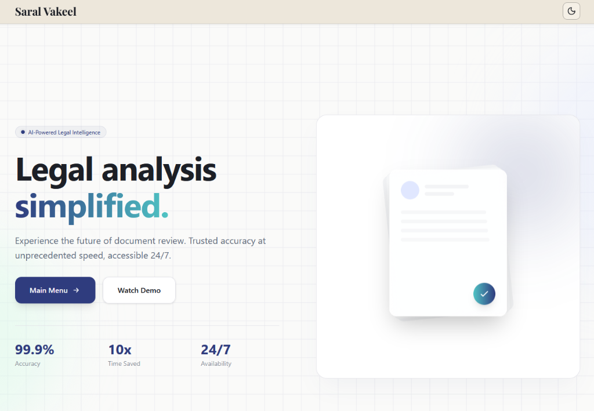

# Saral Vakeel (Simplified Lawyer)



**Saral Vakeel** is a scalable, AI-powered legal assistant hosted on **Google Cloud Platform (GCP)**. It leverages **Google Gemini** and RAG technology to simplify complex legal documents, offering instant summaries, risk detection, and precise citations with enterprise-grade security and performance.

## 🚀 Features

-   **📄 Intelligent Document Analysis**: Leverages **Google Cloud Document AI** for high-accuracy OCR and extracting key metadata including summaries, risk factors, and obligations using **Google Gemini 2.5 Flash**.
-   **💬 RAG-Powered Chat**: Ask questions about your uploaded documents and get accurate answers grounded in the text, complete with citations and source highlighting.
-   **⚡ Real-Time Processing**: Fast PDF ingestion, text chunking, and vector embedding generation.
-   **☁️ Enterprise-Grade Scalability**: Backend deployed on **Google Cloud Platform (GCP)**, ensuring high availability and the ability to handle massive document workloads effortlessly.
-   **🎨 Modern UI/UX**: A sleek, accessible interface built with **Next.js 15** and **Tailwind CSS**, featuring dark mode support and interactive background animations.
-   **🔍 Precise Citations**: Pinpoints the exact page and paragraph where an answer is found.
-   **🔒 Secure Storage**: Utilizes **Supabase** for secure file storage and vector database management.

## 🛠️ Tech Stack

### Frontend
-   **Framework**: [Next.js 15](https://nextjs.org/) (React 19)
-   **Styling**: [Tailwind CSS 4](https://tailwindcss.com/)
-   **Animations**: [Framer Motion](https://www.framer.com/motion/)
-   **Icons**: [Lucide React](https://lucide.dev/)
-   **State/Data**: Axios, SWR (implied)

### Backend & Infrastructure
-   **Framework**: [FastAPI](https://fastapi.tiangolo.com/) (Python)
-   **Cloud Provider**: **Google Cloud Platform (GCP)** (Serverless/Scalable Deployment)
-   **Document Processing**: **Google Cloud Document AI** (Intelligent OCR & Data Extraction)
-   **AI/LLM**: [Google Gemini](https://ai.google.dev/) (Flash 2.5 for Chat & Embedding-004 for Vectors)
-   **Orchestration**: [LangChain](https://www.langchain.com/)
-   **PDF Processing**: `pdfplumber`

### Database & Storage
-   **Vector Store**: [Supabase](https://supabase.com/) (pgvector)
-   **Authentication & Storage**: Supabase Auth & Storage

## 📋 Prerequisites

Before running the project, ensure you have the following installed:

1.  **Node.js** (v18 or higher)
2.  **Python** (v3.10 or higher)
3.  **Supabase Account** (for database and storage)
4.  **Google Cloud API Key** (with Gemini API access)

## ⚙️ Installation & Setup

### 1. Clone the Repository
```bash
git clone https://github.com/yourusername/saral-vakeel.git
cd saral-vakeel
```

### 2. Backend Setup
Navigate to the backend directory and set up the Python environment.

```bash
cd backend
python -m venv venv

# Activate virtual environment
# Windows:
venv\Scripts\activate
# Mac/Linux:
# source venv/bin/activate

pip install -r requirements.txt
```

Create a `.env` file in the root directory (parent of `backend`) with the following credentials:
```env
SUPABASE_URL=your_supabase_url
SUPABASE_KEY=your_supabase_anon_key
GOOGLE_API_KEY=your_google_gemini_api_key
```

### 3. Frontend Setup
Navigate to the frontend directory and install dependencies.

```bash
cd ../frontend
npm install
```

Create a `.env.local` file in the `frontend` directory:
```env
NEXT_PUBLIC_API_URL=http://localhost:8000
NEXT_PUBLIC_SUPABASE_URL=your_supabase_url
NEXT_PUBLIC_SUPABASE_ANON_KEY=your_supabase_anon_key
```

## 🏃‍♂️ Running the Application

### Start the Backend
From the `backend` directory (with venv activated):
```bash
uvicorn main:app --reload
```
The backend API will run at `http://localhost:8000`.

### Start the Frontend
From the `frontend` directory:
```bash
npm run dev
```
The application will be available at `http://localhost:3000`.

## 📂 Project Structure

```
c:\laww\
├── backend/
│   ├── main.py              # Main FastAPI application & RAG logic
│   ├── requirements.txt     # Python dependencies
│   └── ...
├── frontend/
│   ├── app/                 # Next.js App Router pages
│   ├── components/          # React components (Chat, Upload, Visuals)
│   ├── lib/                 # Utility functions (Supabase, API)
│   ├── public/              # Static assets
│   └── ...
├── README.md                # Project documentation
└── .env                     # Backend environment variables
```

## 🤝 Contribution
Contributions are welcome! Please fork the repository and submit a pull request for any enhancements or bug fixes.

## 📄 License
This project is licensed under the MIT License.
